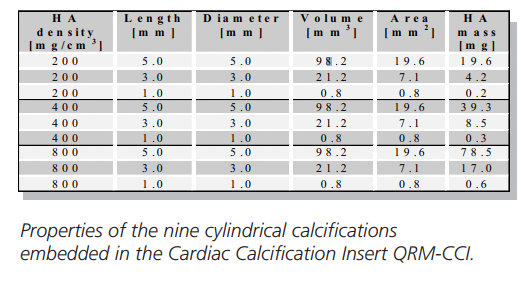

# CAC-stanford-data

Repository for comparing the integrated calcium scoring technique with the FQM technique laid out in [this paper](https://aapm.onlinelibrary.wiley.com/doi/10.1002/mp.14912)

* [Original code](https://github.com/nwerf/FQM_Analysis)
* [Integrated calcium scoring](https://github.com/Dale-Black/CalciumScoring.jl)

## QRM Phantom Information
[Manual](https://www.qrm.de/en/products/cardiac-calcification-phantom/?type=3451&downloadfile=1681&cHash=e8954eadba3d3080e26d021c0c8c0a5d)

### Calcification Inserts Information
